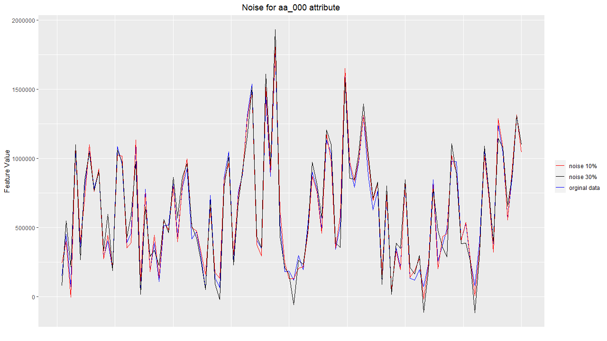
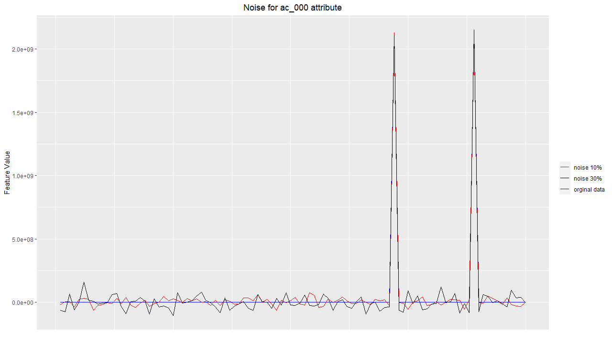
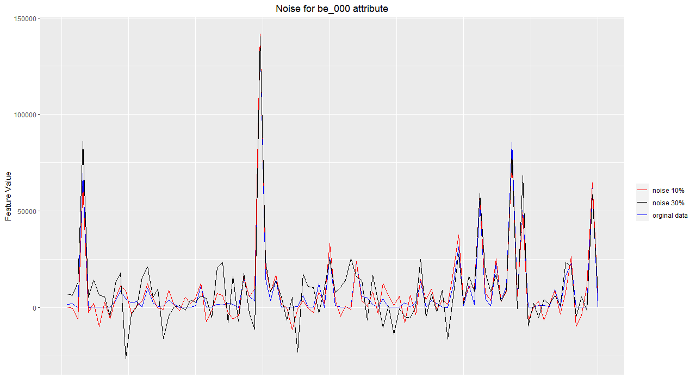
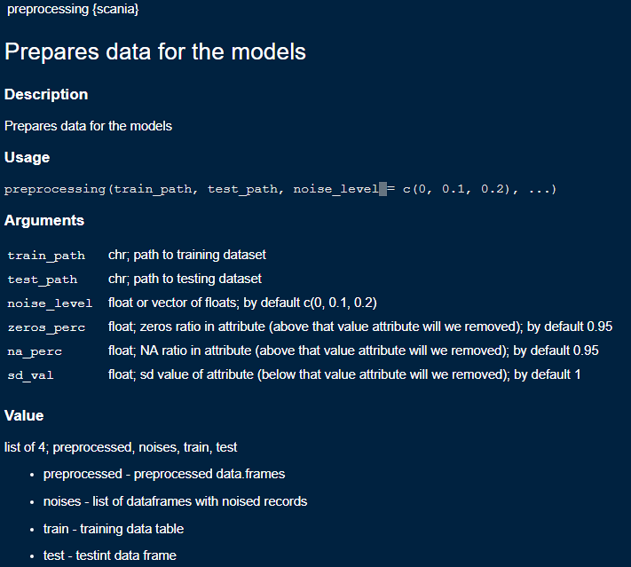
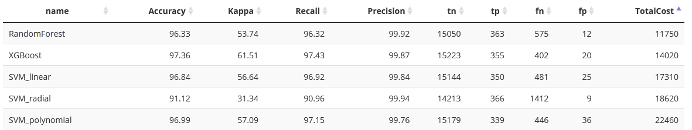
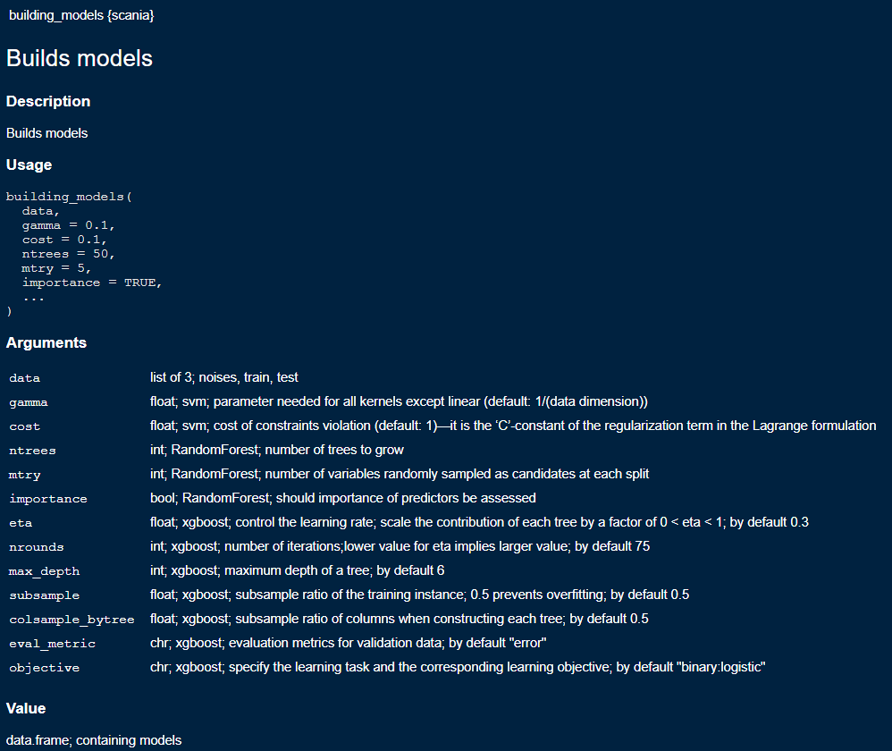
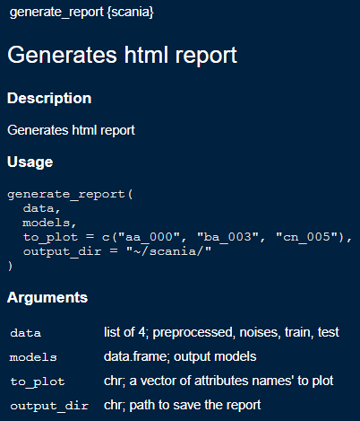

Spis treści:

* [1. Instalacja](#instalacja)

* [2. Opis](#opis)

* [3. Przetwarzanie danych](#dane)

* [4. Modele](#modele)

* [5. Raport](#raport)

<h1 id="instalacja">1. Instalacja</h1>

```
devtools::install_github("chmjelek/scania")
```

Przy zapytaniu:
```
Enter one or more numbers, or an empty line to skip updates:
```

Należy wpisać `3` i potwierdzić klawiszek `enter`.

Po instalacji stwórz skrypt i wywołaj pakiet używając `scania::` albo `library(scania)`

Aby zobaczyć pełną listę eksportowanych funkcji:

```
library(scania)
ls("package:scania")
```

Dane należy pobrać: [link](https://archive.ics.uci.edu/ml/machine-learning-databases/00421/).

Przykładowe wywowałanie:

```
data <- scania::preprocessing(
    train_path = file.path("path", "to", "your", "aps_failure_training_set.csv"),
    test_path = file.path("path", "to", "your", "aps_failure_test_set.csv")
)

models <- scania::building_models(data)

scania::generate_report(data = data, models = models)
```

<h1 id="opis">2. Opis</h1>

Projekt dotyczy zastosowania technik uczenia maszynowego w przemyśle produkcyjnym i samochodowym. Projekt opiera się na danych uzyskanych z czujników samochodów ciężarowych Scania w celu przewidywania awarii związanych z układami ciśnienia powietrza.

Dane z czujników zostały dostarczone przez ekspertów i nie podali oni żadnych nazw atrybutów z powodów zastrzeżonych. Tak więc, otrzymaliśmy dane bez nazw atrybutów z repozytorium uczenia maszynowego [UCI](https://archive.ics.uci.edu/ml/datasets/APS+Failure+at+Scania+Trucks). Dane mają 171 atrybutów, wiele brakujących wartości. Istnieje również macierz kosztów błędnej klasyfikacji, a celem jest zredukowanie tych kosztów.

Głównym celem jest sklasyfikowanie awarii w samochodach ciężarowych Scania, czy są one spowodowane przez podzespoły związane z APS (Air Pressure System) czy przez inne podzespoły, które nie są związane z APS. Dane mają tylko dwie klasy, tzn. pozytywną lub negatywną. Jest to więc problem klasyfikacji binarnej.

Z problemem tym związany jest również koszt błędnej klasyfikacji:

; wykonania niepotrzebnej kontroli (false negative), wynosi 10

; niewykrycia wadliwej ciężarówki (false positive), co może spowodować awarię, wynosi 500  

Stąd koszt ogólny wynosi: 

gdzie:

*  - liczba niepotrzebnych kontroli

*  - liczba niewykrytych wadliwych ciężarówek

Naszym zadaniem jest minimalizacja tego kosztu.

Dane są bardzo niezrównoważone, aby poradzić sobie z tym problemem, zastosowano różne metody samplingu. Poniżej znajduje się krótki opis naszego podejścia.

<h1 id="dane">3. Przetwarzanie danych</h1>

## Dane

Zbiór treningowy zawierał w sumie 60000 przykładów, z czego
59000 należy do klasy negatywnej, a 1000 do pozytywnej. 

Klasa była objaśniana przez 170 atrybutów.

Pakiet pozwala na wstępne przetworzonie danych, atrybuty z:

* więcej niż `x%` zer
* więcej niż `y%` brakujących danych
* o odchyleniu standardowym poniżej `z`

mogą zostać usunięte. 

Pozostałe brakujące dane atrybutu uzupełnić jego medianą.

## Sampling

Zdecydowaliśmy się użyć upsamplingu dla klasy mniejszej (pozytywnej, z 1000 przykładów), oraz undersamplingu dla klasy większej (negatywnej, z 59000 przykładami), tak aby liczba przykładów w każdej klasie była równa.

Upsampling został wykonany przez kopiowanie oryginalnych klas pozytywnych, undersampling przez losowe wybieranie przykładów z klasy negatywnej, aby dopasować liczbę przykładów w klasie pozytywnej.

Pakiet pozwalala na tworzenie dowolnej ilości kopii klasy mniejszej (wraz z mniejszeniem klasy większej).

## Szum

Do skopiowanych przykładów klas pozytywnych dodawany jest szum (wartość liczbową pochodzącą z rozkładu normalnego danej cechy). Zabieg ten ma na celu zróżnicowanie skopiowanych przykładów klas pozytywnych. Chcieliśmy sprawdzić, jaki wpływ na model będzie miał taki proces.

Proces dodawania szumu:

* ustal współczynnik skali `p`
* znajdź odchylenie standardowe `std` każdego atrybutu `a`
* dla każdej instancji `x` atrybutu `a` oblicz `szum` według podanego wzoru: 
    * `noise = N(0, std(x) * p)`.
* dodaj `noise` do każdej instancji `x`

Współczynnik skali `p` określa stopień szumu, który może być dodany do danych. Im wyższa wartość `p`, tym większy szum jest dodawany. 

Dla każdego egzemplarza oryginalnej klasy pozytywnej można było wybrać inny poziom szumu. 

Kilka przykładów dodawania szumu do atrybutu:







W naszym pakiecie powyższe czynności wykonuje funkcja `preprocessing`



<h1 id="modele">4. Modele</h1>

Wytrenowaliśmy dane za pomocą 5 różnych zaawansowanych technik uczenia maszynowego, takich jak `SVM` z jądrem liniowym, radialnym i wielomianowym, `RandomForest`, algorytm `XGBoost` i obliczyliśmy koszt na podstawie macierzy konfuzji wygenerowanej przez modele. Spośród wszystkich algorytm `RandomForest` zminimalizował koszt znacznie mniej niż pozostałe algorytmy.

Naszym celem jest obliczenie kosztów związanych z błędami złej klasyfikacji i znalezienie najlepszego modelu z minimalnym kosztem. Tak więc, aby obliczyć koszt, generujemy macierz konfuzji dla każdego modelu i porównujemy je na końcu.



Do ewaluacji modeli wykorzystano 9 współczynników:

* Accuracy = (tn + tp / tn + tp + fn + fp) - ile razy poprawnie wskazaliśmy klasę - nie zawsze model z najwyższą dokładnością daje minimalny koszt - (false positive kosztuje 50 razy więcej niż false negative)

* Kappa - dokładność klasyfikacji, z tą różnicą, że jest ona znormalizowana na poziomie bazowym losowego przypadku na zbiorze danych

* Recall = (tp / tp + fn) - stosunek poprawnych pozytywnych przewidywań do całkowitej liczby pozytywnych przykładów

* Precision = (tp / tp + fp) - stosunek poprawnych przewidywań pozytywnych do całkowitej liczby przewidywań pozytywnych

* tn - poprawne wykrycia klasy negatywnej

* tp - poprawne wykrycia klasy pozytywnej

* fn - niewykrycie klasy negatywnej (koszt 10)

* fp - niewykrycie klasy pozytywnej (koszt 500)

* TotalCost - koszt całkowity

W naszym pakiecie powyższe czynności wykonuje funkcja `build_models`



<h1 id="raport">5. Raport</h1>

Pakiet pozwala również na generowanie raportu.

Funkcja `generate_report`:


